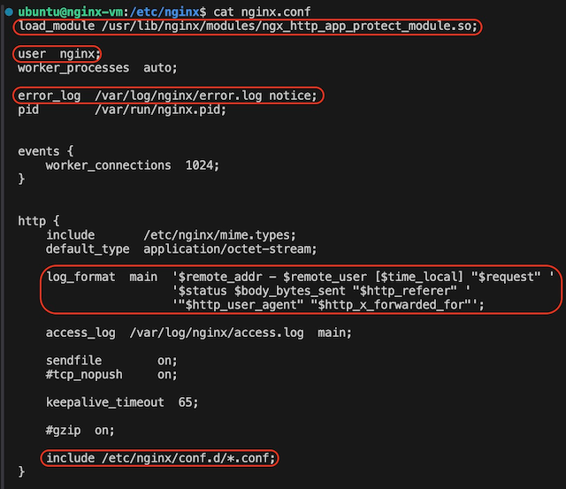

This module will is about basic NGINX configuration for load balancing and healtheck.

**Go to NGINX VM using vscode option**


---
**NGINX Plus with App Protect has been installed in this lab. By default, NGINX configurations are located here:**
- /etc/nginx/nginx.conf
- /etc/nginx/conf.d/default.conf

Let's examine the the content of each file respectively




This folder keeps NGINX default files for healthcheck dashboard and error pages


---
**The lab contains three html web pages. Let's check them out.**

```cd /opt/hol/```


```cat App1/index.html```


Do the same for App2 and App3. All three web config are almost similar; the difference is color code.
```bash
cat App2/index.html
cat App3/index.html
```
---
**Next we will showcase the power and simplicity of NGINX** 

Change to root user and go to /etc/nginx/conf.d folder

```bash
sudo su -
cd /etc/nginx/conf.d
```

---
### ATTENTION: for testing, use curl from VScode or Firefox from NGINX machine Access Method panel.
---

**1. Serve web content**
   
From this git project, copy the content of `basic-lb/config/web.conf` and paste it to `/etc/nginx/conf.d/web.conf` then check the result

```vi web.conf```

Test with curl

```bash
curl http://10.1.1.4:9001
curl http://10.1.1.4:9002
curl http://10.1.1.4:9003
```

Test with Firefox

```bash
http://10.1.1.4:9001
http://10.1.1.4:9002
http://10.1.1.4:9003
```

**2. Configure load balancer**
   
From this git project, copy the content of `basic-lb/config/lb.conf` and paste it to `/etc/nginx/conf.d/lb.conf` then check the result

```vi lb.conf```

Test with curl

```curl http://10.1.1.4:9000```

Test with Firefox

```http://10.1.1.4:9000```

Refresh a few times to see load balance effect.

**3. Configure healthcheck dashboard**
   
From this git project, copy the content of `basic-lb/config/dashboard.conf` and paste it to `/etc/nginx/conf.d/dashboard.conf` then check the result 

```vi dashboard.conf```

Test with curl

```curl http://10.1.1.4:8081/dashboard.html```

Test with Firefox

```http://10.1.1.4:8081/dashboard.html```


On the top right, click on `HTTP Upstreams`


**4. Enable App Protect**

Open `/etc/nginx/conf.d/lb.conf` and uncomment the App Protect portion

```bash
...
app_protect_enable on;
app_protect_policy_file /etc/app_protect/conf/NginxDefaultPolicy.json;
app_protect_security_log_enable on;
app_protect_security_log /opt/app_protect/share/defaults/log_illegal.json /var/log/app_protect/security.log;
...
```

Test with curl

```bash
curl localhost:9000
curl 'localhost:9000/?<script>'
```

---

**Good job! Let's summarize what you have achieved so far:**
- Understand NGINX config file structure
- Configure NGINX to server web content
- Configure NGINX to load balance web pages
- Configure NGINX healthcheck dashboard
- Enable App Protect

Next, we will move on to more advanced configurations, making NGINX a flexible and secured API Gateway!
