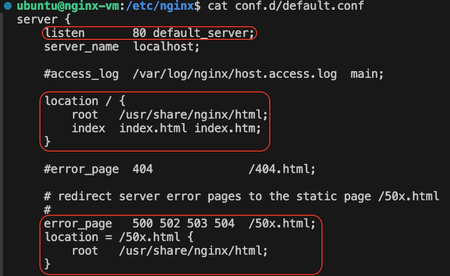
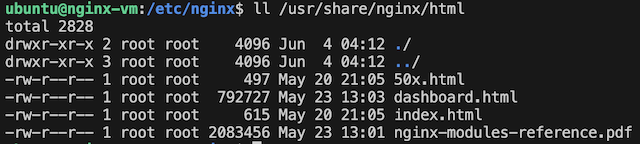

#### Go to NGINX VM using vscode option


---
NGINX Plus with App Protect has been installed in this lab. By default, NGINX configurations are located here:
- /etc/nginx/nginx.conf
- /etc/nginx/conf.d/default.conf

#### Let's examine the the content of each file respectively




This folder keeps NGINX default files for healthcheck dashboard and error pages



---
#### Next, we'll check out three web pages and configure NGINX to load balance them
```cd /opt/hol/```


```cat App1/index.html```


Do the same for App2 and App3
---
